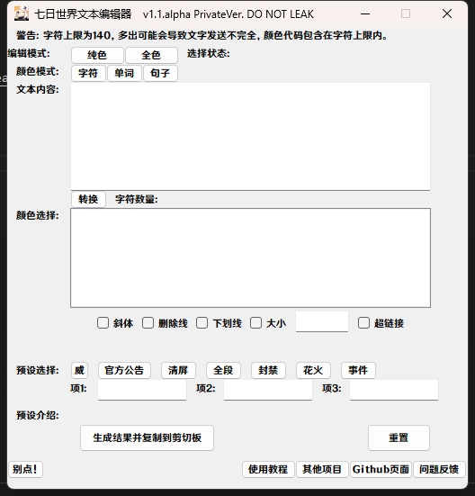
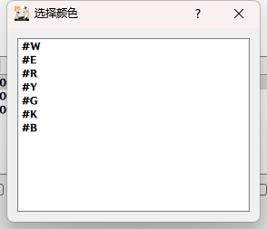
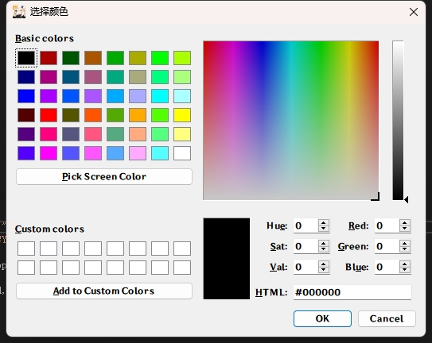

# 基本教程
 这个教程的目的是让绝大部分人会使用这个程序，所以如果你感觉这个教程写的太过低智，请不要阅读这个教程

## 下载
 你需要去[Releases](https://github.com/VisionTravelStudio/Once-Human-Text-Editor/releases)页面下载最新的版本，通常来说只有一个可下载项，下载即可
 下载后可以放在任意位置，此程序不与游戏进行任何沟通

## 使用
 ### 起步
 双击运行程序

 你可以看到一个窗口创建在你的屏幕中心

 
 
 ### 页面内容介绍和如何操作
 从上到下看

 编辑模式：如果你不使用预设，请一定要选择一个编辑模式，同时只能选择一个模式，选择的模式将在选择状态后以文字呈现

    纯色按钮：纯色是指七日世界预设的几种颜色，占用字符数量少，颜色有：黑、白、红、黄、蓝、绿和无颜色

    全色按钮：可以实现任意hex颜色，暂不可编辑透明度，但一个全色的颜色实现需要占用8个字符

 颜色模式：选择完编辑模式后，请一定要选择一个颜色模式，同时只能选择一个模式，选择的模式将在选择状态后以文字呈现

    字符按钮：以每个字符分割

    单词按钮：以每个空格分割，不包括换行和除了空格之外的符号，不支持编辑空格（防止你给空格上色什么的导致多占用字符）

    句子按钮：以每个符号分割，支持所有中英文符号，但不包括空格、换行和#号，需要输入完整的句子（必须以符号结尾）

 在选择完后，你需要在文本内容中输入你想编辑的文本

 输入完成后，请点击转换按钮，点击后将在颜色选择框中显示分割结果

 颜色选择框内会有所有分割后的项，这些项的默认颜色为黑色#000000，如果在项内没有显示字符，请不要编辑这个项，它大概率是空格或换行！！！

 你可以点击每个项来编辑颜色，对于纯色和全色，它们有着不一样的编辑方式

 你可以重复编辑每个项（没有经过验证，不过大概是没问题的）
 
 纯色：

    对应的颜色会在主页面的左侧显示，点击任意颜色项即可把这个颜色应用到要修改的文字项

 全色：

    全色编辑支持所有hex颜色，不过当然不是让你直接输入hex颜色，这很不方便，所以全色模式添加了一个Qt基础调色面板来选择你需要的颜色

    你可以在 Basic colors 选择默认的已创建颜色，选择好后请点击右下方的“OK”按钮来把这个颜色应用到所选文字项

    也可以点击“Pick Screen Color”按钮来选取屏幕上的颜色，选取时需要点击一次鼠标左键，选择好后请点击右下方的“OK”按钮来把这个颜色应用到所选文字项

    也可以在调色板上拖动鼠标选择颜色，选择好后请点击右下方的“OK”按钮来把这个颜色应用到所选文字项

    也可以输入HSV、RGB或Hex值来选择颜色，选择好后请点击右下方的“OK”按钮来把这个颜色应用到所选文字项

    如果你不想选择了，请点击右下方的“Cancel”按钮或右上角的X来关闭全色编辑页面

 斜体：当你勾选了斜体时，文字会倾斜

 删除线：当你勾选了删除线时，文字上会覆盖一条白色的删除线

 下划线：当你勾选了下划线时，文字下方会有一条下划线，跟随文字颜色显示

 大小：公开版本不会出现

 超链接：公开版本不会出现

 当你选择全色模式后，会出现渐变色选项，默认渐变会从左向右渐变，每个文字渐变度一致

    渐变色起始：选择渐变色的起始色

    渐变色结束色：选择渐变色的结束颜色

    反转：勾选后会从右向左渐变

 预设选择页面包含多个选项，他们都是一些简单的预设，可以帮你创建一些有意思的东西

    威：创建类似威发出来的的消息，你需要在文本内容中输入你想让威说的话，并且需要在项1中填入一段用于伪装的话（因为需要看起来不是你发送的） --可能导致你的账号被封禁

    官方公告：创建类似官方公告发出来的的消息，你需要在文本内容中输入你想让官方公告说的话，并且需要在项1中填入一段用于伪装的话（因为需要看起来不是你发送的）--可能导致你的账号被封禁

    清屏：公开版本不会出现 --可能导致你的账号被封禁

    全段：直接修改全段文本颜色，暂时只支持全色修改，请在颜色选择框内修改颜色 --可能导致你的账号被封禁

    封禁：创建类似封禁消息，你需要在文本内容中输入玩家名+UID（格式类似VTSDT#114514），在项2中填入处罚原因，在项3中填入处罚措施，并且需要在项1中填入一段用于伪装的话（因为需要看起来不是你发送的）--可能导致你的账号被封禁

    花火：创建类似一名发出来的的消息，你需要在文本内容中输入你想让要假扮的人说的话，在项2中填入频道名（如：世界），在项3中填入你要伪装的人的名字，并且需要在项1中填入一段用于伪装的话（因为需要看起来不是你发送的） --目前只在中国服务器能伪装完美

    事件：TODO，未完成，如果需要请提交Issue

 生成结果并复制到剪切板：点击后生成编辑结果，并统计字符数量，如果字符数量超过140，可能会导致发送信息不完整

 重置：点击后重置所有项

 剩下的项需要自己探索喽

 ### 发送消息
 如果你不清楚你编辑完成的文本到底是什么样子的，请在私聊或什么地方测试一遍再发送

 点击完“生成结果并复制到剪切板”按钮后，请切换到七日世界窗口，按下键盘上的一个长条形的写着enter的按键来打开聊天框

 请在按下键盘最左下角的按键（上面写着Ctrl）的同时按下按键V，用来粘贴生成完的结果到聊天框内

 再次按下键盘上的一个长条形的写着enter的按键，来发送消息

 ### 一些注意事项
 支持换行

 不要编辑换行符和空格

 可以重重新选择颜色

 可以通知添加斜体、删除线等

 渐变也可以添加斜体、删除线等

 渐变完成后也可以修改每一项的颜色

 Private版本不会公开，更不会售卖，Private只服务于VisionTravel Studio成员和成员的一定量朋友，并会验证HWID
 
 这个程序完全免费，如果你是从什么鬼地方购买来的，那你就被骗了，请举报贩售者并向我们反馈——我们没有义务追回你所损失的财产

